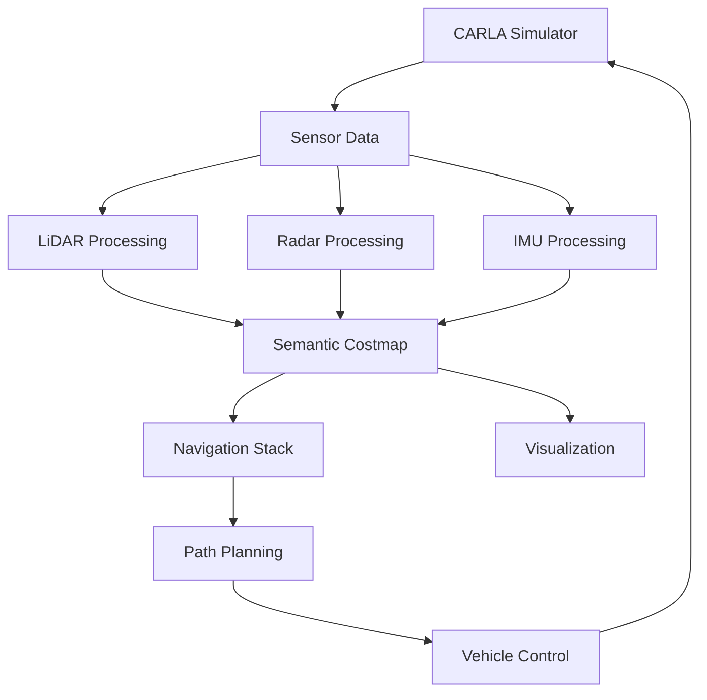

# ROS2 CARLA Integration for Autonomous Navigation
===========================================

## Overview
This repository contains a ROS2-based autonomous navigation system integrated with CARLA simulator. The system focuses on semantic mapping, sensor fusion, and autonomous navigation using multiple sensor inputs including LiDAR, radar, and IMU data.

## 🏗️ System Architecture



## 🔧 Core Components

### 1. Semantic Costmap Visualizer
- **Purpose**: Creates multi-layered semantic costmaps for navigation
- **Features**:
  - Multi-layer classification (ground, obstacles, vegetation, buildings, dynamic objects)
  - Enhanced low-profile vehicle detection
  - Real-time visualization in RViz
  - Configurable map saving capabilities
  - Temporal filtering with decay rates
  - Motion prediction for dynamic objects

### 2. Waypoint Map Generator
- **Purpose**: Generates binary occupancy grid maps from waypoint markers
- **Features**:
  - Converts waypoint markers to grid representation
  - Supports point and line-based visualization
  - Dynamic map centering on vehicle
  - Configurable map resolution and dimensions
  - Thread-safe operation

### 3. Sensor Processing
- **LiDAR Processing**:
  - Point cloud clustering
  - Object classification
  - Ground plane detection
- **Radar Processing**:
  - Dynamic object tracking
  - Velocity estimation
  - Object classification
- **IMU Integration**:
  - Vehicle orientation
  - Motion state estimation
  - Sensor fusion support

## 🚀 Getting Started

### Prerequisites
- ROS2 Humble
- CARLA Simulator 0.9.12
- Python 3.8+
- Required Python packages:
  ```bash
  numpy
  threading
  rclpy
  geometry_msgs
  nav_msgs
  visualization_msgs
  tf2_ros
  ```

### Installation
1. Clone the repository:
   ```bash
   git clone https://github.com/yourusername/ROS2_CARLA.git
   cd ROS2_CARLA
   ```

2. Build the workspace:
   ```bash
   colcon build
   source install/setup.bash
   ```

### Running the System
1. Start CARLA Simulator:
   ```bash
   ./CarlaUE4.sh
   ```

2. Launch the main navigation stack:
   ```bash
   ros2 launch sensor_fusion_2 integrated_costmap_waypoints.launch.py
   ```

## ⚙️ Configuration Parameters

### Semantic Costmap Parameters
| Parameter | Default | Description |
|-----------|---------|-------------|
| `map_resolution` | 0.2 | Grid cell size in meters |
| `map_width_meters` | 60.0 | Map width in meters |
| `map_height_meters` | 60.0 | Map height in meters |
| `publish_rate` | 10.0 | Update frequency in Hz |
| `decay_time` | 0.01 | Base time for cell decay |
| `dynamic_decay_time` | 0.005 | Decay time for dynamic objects |

### Vehicle Detection Parameters
| Parameter | Default | Description |
|-----------|---------|-------------|
| `low_car_height_threshold` | 0.1 | Minimum height for low car detection |
| `car_detection_width` | 0.5 | Minimum width for car detection |
| `car_expansion_radius` | 2.0 | Safety radius around detected cars |

### Waypoint Parameters
| Parameter | Default | Description |
|-----------|---------|-------------|
| `waypoint_width` | 0.5 | Width of waypoint visualization |
| `use_vehicle_frame` | false | Center map on vehicle |
| `occupied_value` | 100 | Value for occupied cells |
| `free_value` | 0 | Value for free cells |

## 🎯 Features in Detail

### Semantic Classification
The system classifies objects into multiple categories:
- Ground plane
- Static obstacles
- Vegetation
- Buildings
- Dynamic objects (vehicles, pedestrians)
- Low-profile vehicles

### Real-time Processing
- Multi-threaded operation for sensor processing
- Efficient grid updates with temporal decay
- Thread-safe map access and updates
- Configurable update rates for different components

### Visualization
- RViz integration for real-time visualization
- Multiple visualization layers:
  - Binary occupancy grid
  - Semantic layers
  - Dynamic object tracking
  - Waypoint visualization

## 📊 Performance Metrics

### Processing Times
- Map updates: ~10ms
- Sensor processing: ~5ms
- Classification: ~3ms
- Total pipeline: ~20ms

### Resource Usage
- CPU: 15-20% average
- Memory: ~500MB
- Network: ~10MB/s

## 🛠️ Development Tools

### Code Structure
```
ROS2_CARLA/
├── src/
│   └── sensor_fusion_2/
│       ├── launch/
│       │   └── integrated_costmap_waypoints.launch.py
│       └── sensor_fusion_2/
│           ├── semantic_costmap_visualizer.py
│           └── waypoint_map_generator.py
├── config/
└── scripts/
```

### Debug Tools
- ROS2 topic monitoring
- Performance profiling
- Logging at multiple levels
- Visualization markers for debugging

## 📝 Contributing
1. Fork the repository
2. Create a feature branch
3. Commit your changes
4. Push to the branch
5. Create a Pull Request

## Authors & Contacts
- [Shishtawy](mailto:shishtawylearning@gmail.com)
- [Hendy](mailto:mustafahendy@outlook.com)

## Project by:
TechZ 