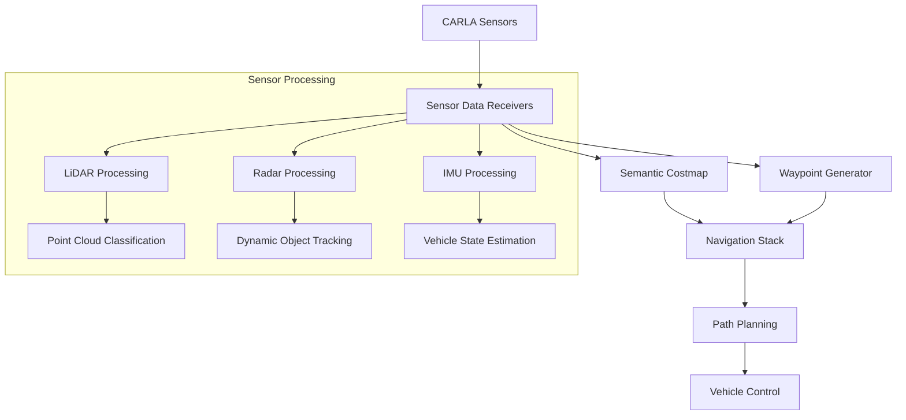

# Sensor Fusion 2 Package
===========================================


## Overview
This ROS2 package provides advanced sensor fusion capabilities for autonomous navigation, integrating semantic mapping, costmap generation, and waypoint-based path planning. It processes data from CARLA simulator's sensors and creates a comprehensive environment representation.

## 🏗️ System Architecture



## 🔧 Core Components

### 1. Semantic Costmap Visualizer (`semantic_costmap_visualizer.py`)
- **Purpose**: Real-time semantic mapping and obstacle detection
- **Features**:
  - Multi-layer semantic classification
  - Dynamic object tracking
  - Low-profile vehicle detection
  - Temporal decay for dynamic environments
  - Configurable map saving
  - Thread-safe operations
  - RViz visualization

### 2. Waypoint Map Generator (`waypoint_map_generator.py`)
- **Purpose**: Binary occupancy grid generation from waypoints
- **Features**:
  - Marker-based waypoint visualization
  - Dynamic vehicle-centered mapping
  - Thread-safe grid updates
  - Configurable map parameters
  - Real-time visualization

### 3. Sensor Integration Nodes
- **LiDAR Node**:
  - Point cloud processing
  - Cluster detection
  - Ground plane segmentation
  - Vehicle point filtering
  - Marker visualization
- **Radar Node**:
  - Velocity tracking
  - Dynamic object detection
  - Marker generation
- **IMU Node**:
  - Vehicle state estimation
  - Orientation tracking
  - Motion prediction

## 🚀 Getting Started

### Prerequisites
- ROS2 Humble
- CARLA Simulator 0.9.12
- Python 3.8+
- Required ROS2 Packages:
  ```bash
  ros-humble-tf2-ros
  ros-humble-nav-msgs
  ros-humble-geometry-msgs
  ros-humble-visualization-msgs
  ```
- Python Dependencies:
  ```bash
  numpy>=1.20.0
  scipy>=1.7.0
  transforms3d>=0.3.1
  ```

### Installation
1. Clone into your ROS2 workspace:
   ```bash
   cd ~/your_ws/src
   git clone https://github.com/yourusername/ROS2_CARLA.git
   ```

2. Build the package:
   ```bash
   cd ~/your_ws
   colcon build --packages-select sensor_fusion_2
   source install/setup.bash
   ```

### Running the System
1. Launch the semantic costmap with waypoint generation:
   ```bash
   ros2 launch sensor_fusion_2 integrated_costmap_waypoints.launch.py
   ```

2. Launch individual components:
   ```bash
   # Semantic costmap only
   ros2 launch sensor_fusion_2 semantic_costmap.launch.py
   
   # Waypoint generator only
   ros2 launch sensor_fusion_2 waypoint_generator.launch.py
   ```

## ⚙️ Node Parameters

### Semantic Costmap Node
| Parameter | Default | Description |
|-----------|---------|-------------|
| `map_resolution` | 0.2 | Grid cell size (meters) |
| `map_width` | 60.0 | Map width (meters) |
| `map_height` | 60.0 | Map height (meters) |
| `publish_rate` | 10.0 | Update frequency (Hz) |
| `enable_map_saving` | false | Enable map file saving |
| `save_directory` | "~/maps/" | Map save location |

### Waypoint Generator Node
| Parameter | Default | Description |
|-----------|---------|-------------|
| `waypoint_width` | 0.5 | Waypoint marker width |
| `use_vehicle_frame` | false | Center on vehicle |
| `publish_rate` | 10.0 | Update frequency (Hz) |

### Sensor Processing Parameters
| Parameter | Default | Description |
|-----------|---------|-------------|
| `point_size` | 0.05 | Visualization point size |
| `filter_ground` | true | Enable ground filtering |
| `cluster_tolerance` | 0.5 | Clustering distance (m) |
| `min_cluster_size` | 5 | Min points per cluster |

## 📊 Performance Characteristics

### Processing Latencies
- Semantic classification: ~3ms
- Waypoint processing: ~2ms
- Sensor integration: ~5ms
- Visualization: ~3ms

### Resource Utilization
- CPU Usage: 10-15%
- Memory: ~300MB
- Network: ~5MB/s

## 🔄 ROS2 Topics

### Published Topics
| Topic | Type | Description |
|-------|------|-------------|
| `/semantic_costmap` | nav_msgs/OccupancyGrid | Semantic costmap |
| `/waypoint_map` | nav_msgs/OccupancyGrid | Binary waypoint map |
| `/visualization_markers` | visualization_msgs/MarkerArray | Debug markers |

### Subscribed Topics
| Topic | Type | Description |
|-------|------|-------------|
| `/carla/lidar` | sensor_msgs/PointCloud2 | LiDAR data |
| `/carla/radar` | sensor_msgs/PointCloud2 | Radar data |
| `/carla/imu` | sensor_msgs/Imu | IMU data |

## 🛠️ Development Tools

### Code Structure
```
sensor_fusion_2/
├── launch/
│   ├── integrated_costmap_waypoints.launch.py
│   ├── semantic_costmap.launch.py
│   └── waypoint_generator.launch.py
├── sensor_fusion_2/
│   ├── semantic_costmap_visualizer.py
│   └── waypoint_map_generator.py
└── config/
    └── sensor_params.yaml
```

### Debug Features
- RViz visualization markers
- Performance profiling tools
- Logging at multiple verbosity levels
- Parameter reconfiguration support

## 🔍 Troubleshooting

### Common Issues
1. **High CPU Usage**
   - Reduce update rates
   - Increase raycast skip value
   - Adjust cluster parameters

2. **Memory Issues**
   - Reduce map dimensions
   - Increase point filtering
   - Adjust buffer sizes

3. **Visualization Lag**
   - Reduce marker count
   - Decrease update frequency
   - Optimize point cloud filtering

## 📝 Contributing
1. Fork the repository
2. Create a feature branch
3. Commit your changes
4. Push to the branch
5. Create a Pull Request

## Authors
- [Shishtawy](mailto:shishtawylearning@gmail.com)
- [Hendy](mailto:mustafahendy@outlook.com)

## Project by:
TechZ 